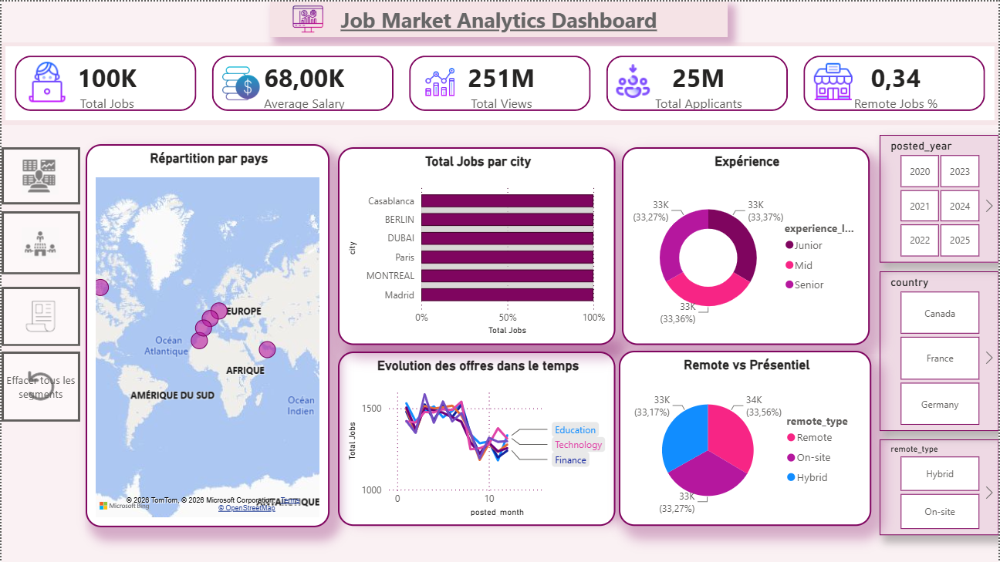
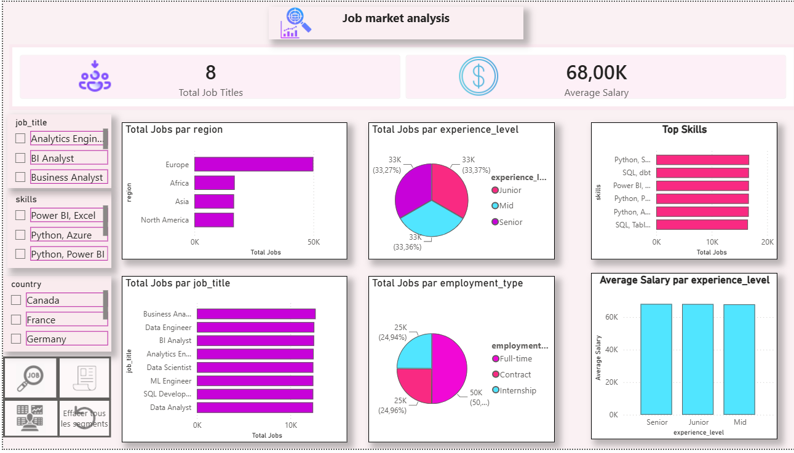
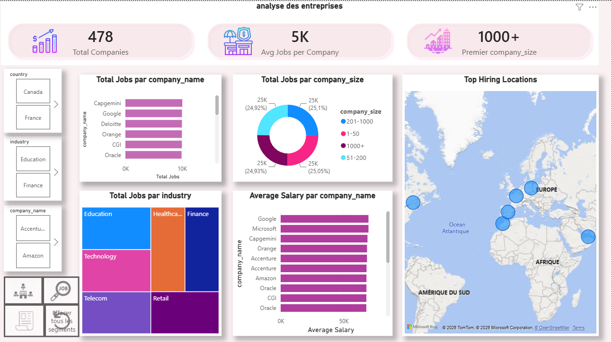

# 📊 Job Market Analytics

> End-to-End Data Engineering & Business Intelligence Project

## 📖 Overview

Job Market Analytics is an end-to-end Data Engineering and Business Intelligence project that analyzes job market data through an automated ETL pipeline and an interactive Power BI dashboard.

The project covers the complete data lifecycle, from data extraction and transformation to data warehousing and visualization, following a modern Medallion Architecture and a Star Schema model.

---

## 🎯 Project Objectives

- Collect and centralize job market data.
- Clean and transform data using Python.
- Build an automated ETL pipeline.
- Store data in a MinIO Data Lake.
- Design a PostgreSQL Data Warehouse.
- Implement a Star Schema.
- Create interactive Power BI dashboards.
- Support data-driven decision making.

---

## 🏗️ Architecture

```text
Source Dataset
      │
      ▼
Python ETL
      │
      ▼
PostgreSQL (Staging)
      │
      ├────────► MinIO Data Lake
      │          Bronze
      │          Silver
      │          Gold
      ▼
PostgreSQL Data Warehouse
      │
      ▼
Power BI Dashboard
```

---

## ⭐ Data Warehouse Model

The project uses a **Star Schema**.

### Fact Table

- fact_jobs

### Dimension Tables

- dim_company
- dim_job
- dim_location
- dim_date

---

## 🛠️ Technologies

- Python
- Pandas
- NumPy
- PostgreSQL
- SQLAlchemy
- MinIO
- Docker
- Apache Airflow
- Power BI
- Git & GitHub

---

# 📊 Dashboard Preview

## 🏠 Dashboard Overview

## 🏠 Dashboard Overview



---

## 📈 Job Market Analysis



---

## 🏢 Company Analysis



---

# 📈 Dashboard Features

### Dashboard Overview

- Total Jobs
- Average Salary
- Total Applicants
- Total Views
- Remote Jobs
- Jobs by Country
- Jobs by City

---

### Job Market Analysis

- Top Job Titles
- Top Skills
- Jobs by Region
- Salary Analysis
- Experience Level
- Employment Types

---

### Company Analysis

- Top Hiring Companies
- Industry Distribution
- Company Size
- Salary by Company
- Hiring Locations

---

## 🚀 Project Highlights

- End-to-End ETL Pipeline
- Medallion Architecture (Bronze, Silver, Gold)
- PostgreSQL Data Warehouse
- Star Schema Modeling
- Interactive Power BI Dashboard
- Automated Workflow with Apache Airflow
- Cross-page Filters
- Dashboard Navigation

---

## 💡 Business Value

The dashboard helps users:

- Analyze job market trends.
- Identify in-demand skills.
- Compare salaries.
- Explore hiring companies.
- Analyze geographic distribution.
- Support business decision-making.

---

## 👩‍💻 Author

**Manal Bessar**

Junior Data Analyst

LinkedIn: https://www.linkedin.com/in/manal-bessar-71398a3b9/

GitHub: https://github.com/manalbessar-cpu
